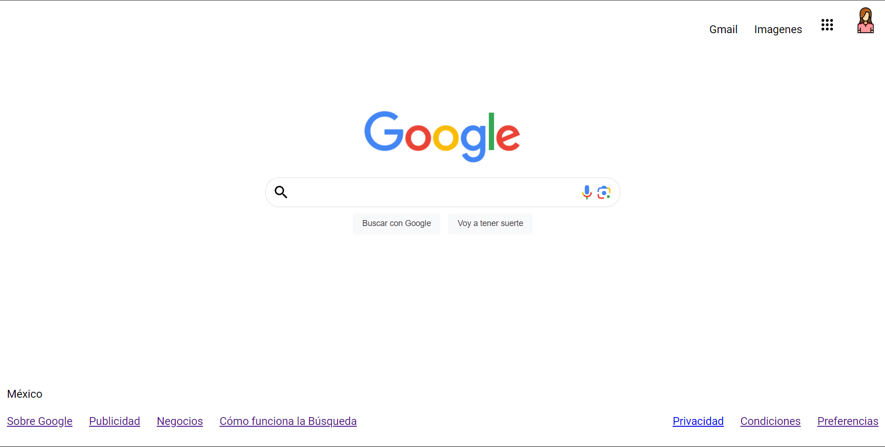

# Clon de Google

## Descripción proyecto

Sitio web desarrollado con HTML para el bootcamp de technolochicas PRO, en el cual se lleva acabo el uso de etiquetas básicas y la carga de recursos externos (imágenes) y links para navegación dentro y fuera del sitio, con la finalidad de recrear el diseño de la pantalla principal de Google.

### Link del proyecto

[Proyecto desplegado](assets/1.png)

### Capturas del proyecto

###### Créditos: Alejandra Gaspar para el bootcamp de Technolochicas PRO